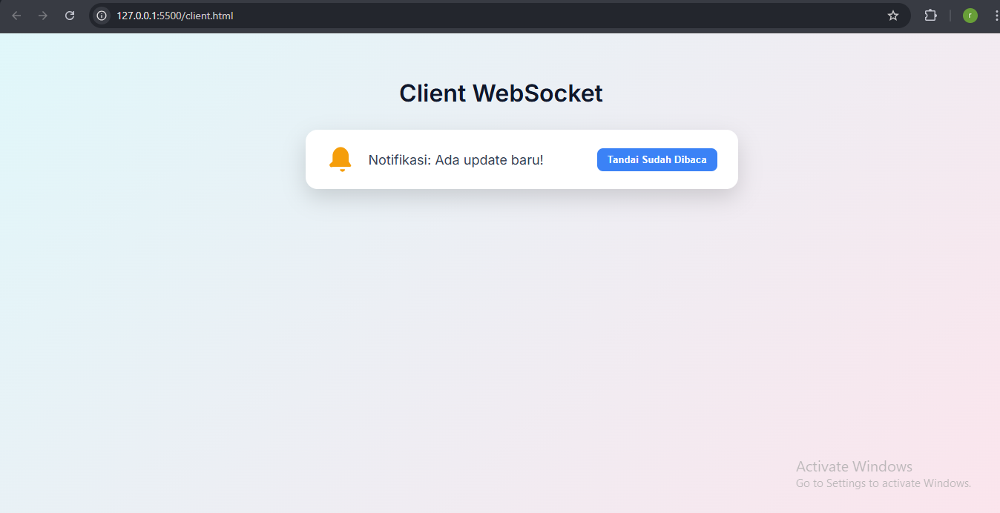

## 🔔 Membuat Notifikasi Real-Time Sederhana Menggunakan WebSocket dan Node.js

## PROFIL

|  |  |
| -------- | --- |
| **Nama** | Raditra Ikhwanul Arifin |
| **Kelas** | TI.23.A.5 |
| **Mata Kuliah** | Pemrograman Web 2 |
| **Dosen Pengampu** | Agung Nugroho S.kom, M.kom |
---

## Deskripsi Proyek
Proyek ini merupakan sebuah eksperimen sederhana yang bertujuan untuk membangun sistem notifikasi berbasis WebSocket menggunakan Node.js sebagai server, dan HTML sederhana sebagai client.

Dalam implementasinya, server WebSocket akan:

* Dibuat menggunakan library ringan bernama ws di Node.js.

* Mendengarkan koneksi masuk dari client di port 8080.

* Mengirimkan pesan notifikasi otomatis kepada setiap client yang terhubung, beberapa detik setelah koneksi berhasil dilakukan.

Di sisi lain, client (berbasis HTML + JavaScript) akan:

* Menginisialisasi koneksi WebSocket ke server.

* Menerima pesan notifikasi dan menampilkannya langsung di browser tanpa perlu reload halaman.

* Menangani status koneksi seperti open, message, error, dan close.

Proyek ini hanya membutuhkan dua file utama:

1. **server.js** – sebagai WebSocket server yang menangani koneksi dan mengirimkan notifikasi.

2. **client.html** – sebagai tampilan client yang menampilkan notifikasi dari server secara real-time.

Dengan struktur proyek yang minimalis namun fungsional, eksperimen ini sangat cocok untuk pemula yang ingin belajar dasar-dasar komunikasi real-time menggunakan WebSocket dan Node.js tanpa kompleksitas framework tambahan.

---

## Cara Menjalankan
1. Buat folder Project:
```
mkdir websocket-notif
cd websocket-notif
```
2. inisialisasi project Node.js:
```
npm init -y
```
3. Install Library WebSocket:
```
npm install ws
```
4.  Buat Server WebSocket 

Buat file **server.js**

```
const WebSocket = require('ws');

// Buat server WebSocket di port 8080
const wss = new WebSocket.Server({ port: 8080 });

console.log('WebSocket server berjalan di ws://localhost:8080');

// Saat ada client yang konek
wss.on('connection', function connection(ws) {
  console.log('Client terkoneksi');

  // Kirim notifikasi ke client setelah 3 detik
  setTimeout(() => {
    ws.send('🔔 Notifikasi: Ada update baru!');
  }, 3000);

  // Kalau client kirim sesuatu (optional, bisa diabaikan di notifikasi)
  ws.on('message', function incoming(message) {
    console.log('Pesan dari client:', message.toString());
  });
});

```
5.  Buat Client Websocket

Buat file **Client.html**

```
<!DOCTYPE html>
<html lang="en">
<head>
  <meta charset="UTF-8">
  <title>WebSocket Notifikasi</title>
  <link href="https://fonts.googleapis.com/css2?family=Inter:wght@400;600&display=swap" rel="stylesheet">
  <style>
    body {
      font-family: 'Inter', sans-serif;
      background: linear-gradient(135deg, #e0f7fa, #fce4ec);
      min-height: 100vh;
      margin: 0;
      padding: 40px;
      display: flex;
      flex-direction: column;
      align-items: center;
      justify-content: flex-start;
    }

    h1 {
      color: #0f172a;
      margin-bottom: 30px;
    }

    .notif-card {
      display: flex;
      align-items: center;
      background-color: #fff;
      padding: 20px 28px;
      border-radius: 16px;
      box-shadow: 0 12px 30px rgba(0, 0, 0, 0.15);
      max-width: 600px;
      width: 100%;
      gap: 16px;
      position: relative;
      animation: popIn 0.4s ease;
    }

    .notif-icon {
      width: 40px;
      height: 40px;
    }

    .notif-text {
      font-size: 18px;
      color: #334155;
      flex-grow: 1;
    }

    .btn-dismiss {
      background-color: #3b82f6;
      color: white;
      border: none;
      padding: 8px 14px;
      border-radius: 8px;
      cursor: pointer;
      font-weight: 600;
      transition: background-color 0.2s;
    }

    .btn-dismiss:hover {
      background-color: #2563eb;
    }

    @keyframes popIn {
      0% {
        transform: scale(0.9);
        opacity: 0;
      }
      100% {
        transform: scale(1);
        opacity: 1;
      }
    }
  </style>
</head>
<body>
  <h1>Client WebSocket</h1>
  <div id="notif"></div>

  <script>
    const socket = new WebSocket('ws://localhost:8080');

    socket.onopen = function () {
      console.log('Tersambung ke server WebSocket.');
    };

    socket.onmessage = function (event) {
      console.log('Pesan dari server:', event.data);

      const notifContainer = document.getElementById('notif');
      notifContainer.innerHTML = `
        <div class="notif-card">
          <svg class="notif-icon" xmlns="http://www.w3.org/2000/svg" fill="#f59e0b" viewBox="0 0 24 24">
            <path d="M12 2a7 7 0 00-7 7v4.586l-1.707 1.707A1 1 0 005 18h14a1 1 0 00.707-1.707L18 13.586V9a7 7 0 00-7-7zm1 18h-2a2 2 0 104 0h-2z"/>
          </svg>
          <div class="notif-text">${event.data.replace('🔔 ', '')}</div>
          <button class="btn-dismiss" onclick="dismissNotif()">Tandai Sudah Dibaca</button>
        </div>
      `;
    };

    function dismissNotif() {
      document.getElementById('notif').innerHTML = '';
    }

    socket.onerror = function (error) {
      console.error('WebSocket error:', error);
    };

    socket.onclose = function () {
      console.log('Koneksi WebSocket ditutup.');
    };
  </script>
</body>
</html>

```
6. Jalankan Server
```
node server.js
```

7. Pengujian

Setelah server berjalan, selanjutnya kita bisa mencobanya, untuk membukanya bisa melalui browser ataupun melalui Live server dari VScode

---
## 📸 Dokumentasi





---

## 📚 Referensi

    * Node.js Official Website

    * Ws — WebSocket Library for Node.js

    * WebSocket API (MDN)
    
---
